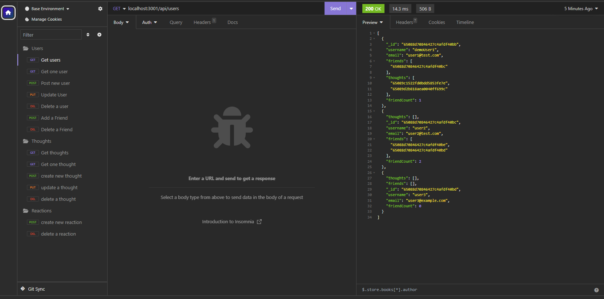

#  Social Network API

## Project Description
An app for social networking. Users can add friends and post their thoughts. Other users can view users' thoughts and create reactions to the thoughts. MongoDB and mongoose are used to handle the database for the app. Node.js is used for the api. 

Preview video: https://watch.screencastify.com/v/rt1B1UQ41TKwPJeX7mBF

Github: https://github.com/cdziedzic/social-network-API

### Screenshot of content

## Table of contents

- [Installation](#installation)
- [License](#license)
- [Questions](#questions)

### Installation
enter index.js in the terminal

### License

### Questions

[My github](github.com/cdziedzic)

E-mail: cdziedzic@gmail.com